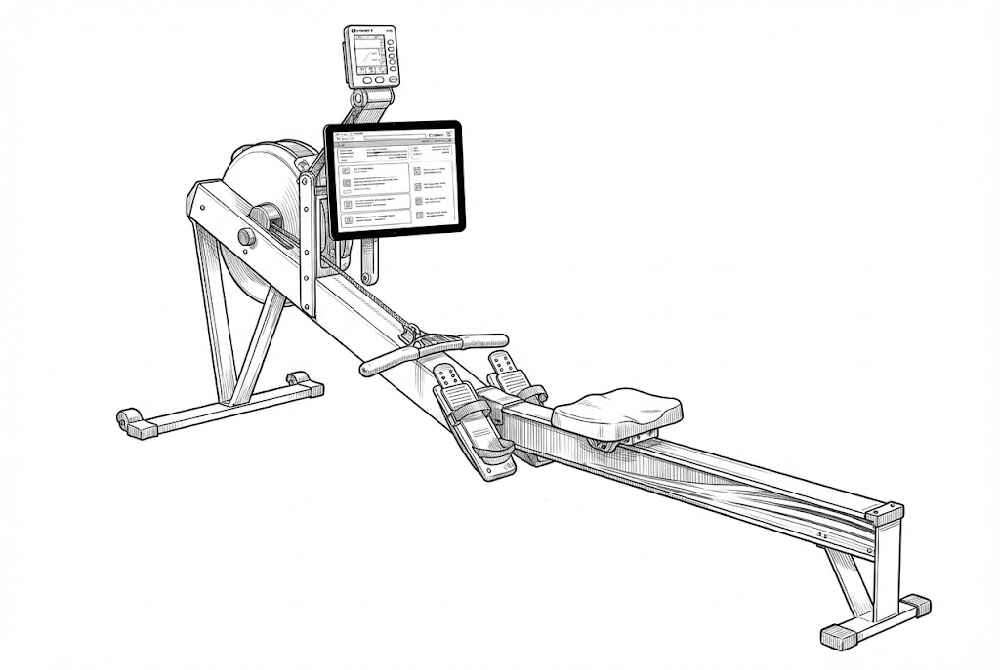

# CatchDash

CatchDash is a split-pane dashboard designed for use on a rowing machine, especially at the catch of each stroke where you can quickly tap large controls.

The app is built to surface useful information without deep navigation:

- audio-first topic feeds with on-demand TTS and optional LLM backed summarization
- live social monitoring (e.g. Mastodon, Bluesky, Reddit, Hacker News)

CatchDash is configurable by design. You can define and tune content sources in `backend/config/topics.yaml`:

- topic feeds (e.g. Mets, arXiv, AI/LLM, News, etc.)
- per-source adapters and URLs
- live social source settings (tags, handles, subreddits, queries)

The default UI supports quick, glanceable interactions while rowing, but the same architecture also works as a general configurable dashboard.


## Repository layout

- `backend/`: FastAPI API, topic ingestion pipeline, live social endpoints
- `frontend/`: Vite + React client UI
- `worker/`: async worker for TTS extraction/summarization/synthesis jobs
- `dev/`: local Docker Compose orchestration and helper scripts

## Quick start (Docker)

```bash
cp backend/config/topics.yaml.example backend/config/topics.yaml
cd dev
cp .env.example .env
docker compose up -d --build backend kokoro worker frontend
```

Open:

- Frontend: `http://localhost:5174`
- Backend health: `http://localhost:8080/healthz`

## Local development

- Backend: see `backend/README.md`
- Frontend: see `frontend/README.md`
- Worker: see `worker/README.md`
- Dev orchestration/scripts: see `dev/README.md`
